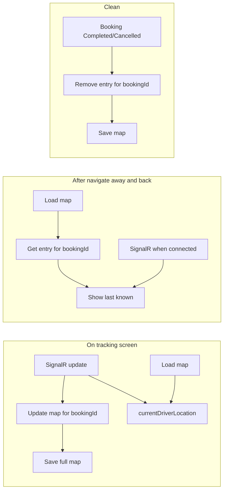

# Persist driver location for tracking screen

## Overview

Add local persistence of the last known driver location **per booking** so that when the user navigates away from the tracking screen and returns (or when live SignalR updates are not yet available), the map still shows the last known position. Storage is **one persisted map** of locations for different drivers/bookings, kept **clean** by removing entries for completed/cancelled bookings and optionally pruning by age or size. **No new package**: use existing `expo-secure-store`.

## Where the map gets the driver location

The map **always prefers live data**; storage is **only a fallback** when live data is not available.

1. **SignalR (primary)** – If there is a current live update, the map uses it. We never replace live data with stored data.
2. **Storage (fallback)** – If there is no SignalR update (e.g. user just returned to the screen, or SignalR is not connected yet), the map uses the last location we saved for that booking.
3. **trackingData?.driverLocation (fallback)** – If both of the above are missing, use the API value (currently the API returns `null`).

We only **write** to storage when we receive a SignalR update, so stored data is always a copy of the last live update, not a separate source.

## Driver location data includes a date (timestamp)

Each stored driver location entry includes a **timestamp** so we can clean old data and reason about freshness:

- **Stored entry**: `{ latitude, longitude, timestamp, driverId? }` with `timestamp` as ISO 8601 string (e.g. `new Date().toISOString()`).
- **SignalR payload** (in `useSignalR`): Already has a `timestamp` field; when persisting we can use that or the time at write (`new Date().toISOString()`).

The timestamp is used for optional global cleanup (e.g. drop entries older than 24–48 hours).

## Problem

- Driver location comes from SignalR (`realTimeDriverLocation`) and fallback `trackingData?.driverLocation` (API currently returns `null`).
- When the user navigates away, the tracking screen unmounts and SignalR state is lost. On return, the map shows no driver until the next SignalR update.
- We need a **list of locations** for **different drivers and bookings**, stored in a **persisted, clean** way.

## Storage design

### Single key, one map (list of locations by booking)

- **Storage**: `expo-secure-store` (existing dependency).
- **Key**: Single key, e.g. `driver_locations`.
- **Value**: One JSON object acting as the list/map of last-known locations for all bookings:

```ts
type DriverLocationsMap = {
  [bookingId: string]: {
    latitude: number;
    longitude: number;
    timestamp: string;   // ISO, for cleanup by age
    driverId?: string;   // optional
  };
};
```

- **Read**: Get item `driver_locations` → parse JSON → full map.
- **Write**: Get map, set `map[bookingId] = { latitude, longitude, timestamp, driverId? }`, save back.
- **Clean**: See below.

### How to purge the location storage

Purge keeps the stored map small and relevant. Two levels:

**1. Per-booking purge (remove one entry)**

- **When**: As soon as we know a booking is **Completed** or **Cancelled** (e.g. when `booking?.status` is one of these on the tracking screen, or when we load booking and status is already completed/cancelled).
- **Where**: In **app/tracking.tsx** – e.g. in a `useEffect` that depends on `booking?.status` and `id`: if status is Completed or Cancelled, call `driverLocationStorage.removeDriverLocation(id)`.
- **What**: Read map, `delete map[bookingId]`, write map back. No other entries are touched.

**2. Global purge (prune by age or by size)**

- **When**: Run in three places so storage is cleaned even if the user rarely or never opens the tracking screen:
  - **On read**: In `getLastDriverLocation()`, after reading the map, run purge, then save (if changed) and return the requested entry.
  - **On write**: In `setLastDriverLocation()`, after updating the map, run purge, then save.
  - **On app launch (or app foreground)** – **important**: If the user only opened tracking once and then exits or never navigates to tracking again, get/set are never called again, so purge would never run. Expose a **global-purge-only** function and call it when the app starts or comes to foreground; then the next time the user opens the app we read the map, drop entries older than 48h (and/or over the size limit), and save. No need to open the tracking screen.
- **How (app launch)**: In `driverLocationStorage`, add `purgeDriverLocationsIfNeeded(): Promise<void>` – reads the map, runs the same age/size purge logic, saves if changed. In the app root (e.g. `app/_layout.tsx`), call it once on mount and/or when `AppState` becomes `active`.
- **Rules** (pick one or both, implement in `driverLocationStorage`):
  - **By age**: Drop any entry whose `timestamp` is older than e.g. **48 hours**. Compare `new Date(entry.timestamp).getTime()` to `Date.now() - 48 * 60 * 60 * 1000`.
  - **By size**: If the number of entries exceeds e.g. **50**, keep only the most recent 50 (sort by `timestamp`, keep last 50, rebuild map keyed by `bookingId`).
- **What**: Filter the map (by age and/or size), then `SecureStore.setItemAsync(key, JSON.stringify(cleanedMap))`. Never delete the whole key unless we explicitly add a “clear all” API; normal purge only removes some entries.

**If the user only checked tracking once**

- Per-booking purge (remove when Completed/Cancelled) runs only when the user is on the tracking screen and we see that status. If they never open tracking again after the booking completes, that booking's entry is not removed by per-booking purge. It is still removed by **global purge by age** (e.g. after 48 hours) and by **global purge on app launch**: the next time they open the app, `purgeDriverLocationsIfNeeded()` runs and drops old entries. So storage still gets cleaned without requiring another visit to the tracking screen.

## Data flow



## Build plan (implementation checklist)

Use this order when implementing. No new package is required.

**Phase 1 – Storage module**

- [x] Add `shared/services/driverLocationStorage.ts`.
- [x] Define type for stored entry: `{ latitude, longitude, timestamp, driverId? }` and map type `Record<bookingId, entry>`.
- [x] Implement `getLastDriverLocation(bookingId)`: read key, parse map, run global purge (age/size), save if changed, return entry or null.
- [x] Implement `setLastDriverLocation(bookingId, location, driverId?)`: read map, set entry with `timestamp: new Date().toISOString()`, run global purge, save.
- [x] Implement `removeDriverLocation(bookingId)`: read map, delete entry, save.
- [x] Implement private global purge (e.g. drop entries older than 48h and/or keep last 50 by timestamp); call from get and set before save.
- [x] Add `purgeDriverLocationsIfNeeded(): Promise<void>` (read map, run same purge, save if changed); use in app launch so purge runs even if user never opens tracking again.
- [x] Use `expo-secure-store` only; single key `driver_locations`.

**Phase 2 – App launch purge**

- [x] In `app/_layout.tsx` (or app root), call `driverLocationStorage.purgeDriverLocationsIfNeeded()` once on mount and/or when `AppState` becomes `active`.

**Phase 3 – Tracking screen: load and fallback**

- [x] In `app/tracking.tsx`, add state `persistedDriverLocation` (or similar), initially null.
- [x] On mount/focus when `id` is set, call `getLastDriverLocation(id)` and set state.
- [x] Change `currentDriverLocation` to: `realTimeDriverLocation ?? persistedDriverLocation ?? trackingData?.driverLocation`.

**Phase 4 – Tracking screen: persist on SignalR**

- [x] When `realTimeDriverLocation` updates and `id` is set, call `setLastDriverLocation(id, { latitude, longitude }, driverId)`.

**Phase 5 – Tracking screen: per-booking purge**

- [x] When `booking?.status` is Completed or Cancelled, call `removeDriverLocation(id)` (e.g. in a `useEffect` that depends on `booking?.status` and `id`).

**Phase 6 – Manual verification**

Run the app and perform these two checks. Tick when done.

- [ ] **Persistence and fallback**: Open a booking with live driver tracking, wait for a location update, navigate away, then back. Map should show last known driver location until SignalR updates.
- [ ] **Per-booking purge**: Open tracking for a booking with a driver, complete or cancel it, then open that booking again (or restart app). No driver pin; storage entry was removed.

## Implementation

### 1. Driver location storage module

- **File**: `shared/services/driverLocationStorage.ts`
- **API**:
  - `getLastDriverLocation(bookingId: string): Promise<{ latitude: number; longitude: number; timestamp?: string } | null>`  
    - Reads key `driver_locations`, parses map, runs **global purge** (see [How to purge](#how-to-purge-the-location-storage)), saves if map changed, returns `map[bookingId]` or null.
  - `setLastDriverLocation(bookingId: string, location: { latitude: number; longitude: number }, driverId?: string): Promise<void>`  
    - Reads map, sets `map[bookingId] = { ...location, timestamp: new Date().toISOString(), driverId }`, runs **global purge**, saves map.
  - `removeDriverLocation(bookingId: string): Promise<void>`  
    - Reads map, deletes `map[bookingId]`, saves. Used for **per-booking purge** when booking is completed/cancelled (called from tracking screen).
- **Storage**: `expo-secure-store` (no new package). Single key `driver_locations`, value `JSON.stringify(map)`.
- **Purge**: Implement global purge (by age and/or size) inside this module; call it from get and set. Expose `purgeDriverLocationsIfNeeded()` and call it from the app root on launch/foreground so purge runs even when the user never opens tracking again. Per-booking purge is done by calling `removeDriverLocation(bookingId)` from the tracking screen.

### 2. Tracking screen: load persisted location on mount

In **app/tracking.tsx**:

- Add state, e.g. `persistedDriverLocation`, initially `null`.
- On mount/focus when `id` is set: call `driverLocationStorage.getLastDriverLocation(id)` and set `persistedDriverLocation`.
- **Resolved driver location**:  
  `currentDriverLocation = realTimeDriverLocation ?? persistedDriverLocation ?? trackingData?.driverLocation`

### 3. Tracking screen: persist on SignalR update

- When `realTimeDriverLocation` updates and `id` is set: call `driverLocationStorage.setLastDriverLocation(id, { latitude, longitude }, driverId)` so the single map is updated for this booking and saved.

### 4. Tracking screen: clean when booking ends

- When `booking?.status` is **Completed** or **Cancelled**, call `driverLocationStorage.removeDriverLocation(id)` so that booking’s entry is removed and the map stays clean.

## Files to add

| File | Purpose |
|------|--------|
| `shared/services/driverLocationStorage.ts` | get/set/remove last driver location from single persisted map; optional global cleanup (age/size). Uses `expo-secure-store` only. |

## Files to modify

| File | Change |
|------|--------|
| **app/tracking.tsx** | Load persisted location for `id` on mount/focus; use in `currentDriverLocation` fallback; persist on SignalR update; call `removeDriverLocation(id)` when booking is Completed/Cancelled. |
| **app/_layout.tsx** | Call `purgeDriverLocationsIfNeeded()` on app mount and/or when `AppState` becomes `active` so storage is purged even if the user rarely or never opens tracking. |

## Edge cases

- **Multiple bookings**: Map is keyed by `bookingId`; each booking has its own entry.
- **Booking without driver**: No SignalR updates, so nothing is written; `persistedDriverLocation` stays null after load.
- **Clean**: Entries for completed/cancelled bookings are removed; optional prune by age/size keeps the map bounded.

## Summary

- **Map source**: SignalR is primary; storage is fallback only when live updates are not available.
- **Date in driver location**: Yes. Each entry has a `timestamp` (ISO 8601) for cleanup and freshness; SignalR payload also has a timestamp.
- **Persisted**: Yes; one key in SecureStore holds the full map.
- **Clean**: Remove entry when booking completes/cancels; optionally prune by timestamp or by keeping last N bookings.
- **List for different drivers/bookings**: The list is the map `bookingId → { latitude, longitude, timestamp, driverId? }`.
- **No new package**: `expo-secure-store` only.
